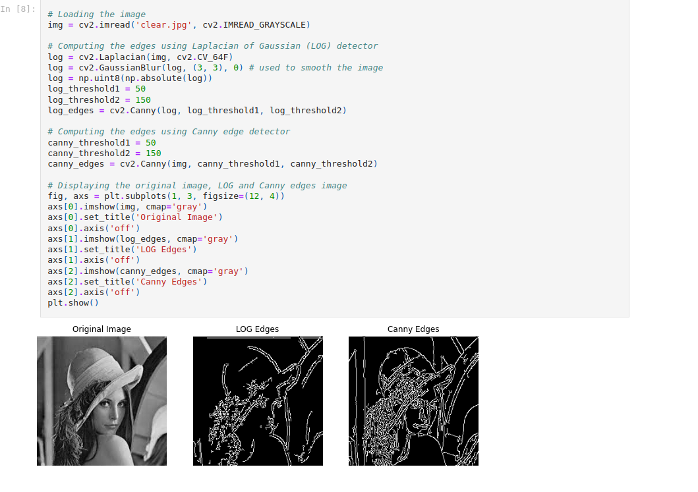

# Image Analysis

In this image analysis project, I focused on enhancing and analyzing digital images using a variety of techniques.
The project encompassed computing image statistics and histograms to gain insights into pixel distributions,
followed by histogram equalization to improve contrast. Binarization was employed to convert images
into black and white by thresholding pixel values.
To enhance image quality, noise reduction was achieved through Median Blur and Gaussian Blur, with experimentation across different blur scales. Edge detection was a pivotal aspect,
involving Prewitt, Sobel, Laplacian of Gaussian, and Canny edge detectors,
revealing prominent edges and contours within images.
Overall, the project aimed to harness these techniques to preprocess and extract essential.

## Conclusion

information from images, ultimately contributing to tasks like feature recognition and pattern analysis across various domains.
